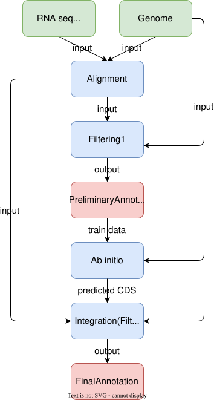

<p align="center">
  
  
</p>

ChimAnn (Chimeric Annotation software, pronounced Kye-mahn) is a **Experimental** DNA annotation software that combines evidence-based and ab initio methods.

### Software Architecture
<p align="center">
  
</p>

- Alignment is performed using [minimap2](https://github.com/lh3/minimap2), [HISAT2](https://daehwankimlab.github.io/hisat2/), [StringTie](https://github.com/Transcriptome-Analysis-Tools/StringTie), and [miniprot](https://github.com/lh3/miniprot)
- Filtering is performed using [EviAnn](https://github.com/alekseyzimin/EviAnn).
- Ab initio gene prediction is performed using [UniAnn](https://github.com/hibiki-kato/UniAnn), fed by [PSAURON](https://github.com/salzberg-lab/PSAURON) emissions and [sitescore](https://github.com/hibiki-kato/sitescore) site scores.
- Integration is performed by EviAnn: UniAnn's CDS are fed back as low-trust external evidence (`-c … --untrusted-cds`).

### Pipeline
`main.nf` (Nextflow DSL2) runs the stages in order; every boundary is a file whose format is pinned in [docs/contracts.md](docs/contracts.md).

| Stage | Module | Tool |
| --- | --- | --- |
| Alignment + filtering | `modules/eviann.nf` | `eviann.sh` |
| Coding-potential emissions | `modules/psauron.nf` | `psauron -a` (per sequence) |
| Site scores (donor/acceptor/start/stop) | `modules/site_scorer.nf` | any tool via `site_train_cmd` / `site_score_cmd`; default `sitescore` (convmamba) |
| Ab initio prediction | `modules/uniann.nf` | `uniann.sh` per sequence and strand (- via reverse complement, `bin/strand_tools.py`) |
| Integration | `modules/integrate.nf` | `eviann.sh -c uniann.gff --untrusted-cds` (resumes the EviAnn run) |

### Install
Nextflow is the launcher; each stage's tools come from conda environments.
```bash
conda install -c bioconda nextflow                 # launcher, once
git clone --recurse-submodules https://github.com/hibiki-kato/ChimAnn.git
cd ChimAnn
(cd uniann && ./install.sh)                        # builds uniann/bin
```
Two ways to supply the stage environments:

| profile | what it does |
| --- | --- |
| `-profile conda` | Nextflow builds `environment.yml` (EviAnn, gffcompare/gffread, PSAURON) and `sitescore/environment.yml` (PyTorch + mamba-ssm, CUDA) |
| `-profile local_envs` | uses existing envs by path (edit `nextflow.config`); PSAURON and sitescore need `pip install psauron -e sitescore` in the GPU env |

### Usage
```bash
nextflow run ChimAnn -profile local_envs -params-file params.yaml \
    -work-dir /scratch/chimann_work -resume
```
`params.yaml` (see `example/params.yaml`; all paths absolute):

| param | meaning | default |
| --- | --- | --- |
| `genome` | target genome FASTA | required |
| `rnaseq` | EviAnn `-r` list: one sample per line, `R1.fq.gz R2.fq.gz fastq` | none |
| `proteins` | related-species protein FASTA (EviAnn `-p`) | none → EviAnn downloads Swiss-Prot |
| `eviann_args` | extra `eviann.sh` options | `''` |
| `eviann_src` | directory of a newer `eviann.sh` + helper scripts, prepended to PATH (binaries still come from the env). INTEGRATE needs `--untrusted-cds`, which is in the [hibiki-kato/eviann](https://github.com/hibiki-kato/eviann) fork (branch `path-lookup`) but not yet in conda EviAnn 2.0.6 | none |
| `outdir` | results directory | `results` |
| `threads` | CPUs for EviAnn / INTEGRATE | 16 |
| `min_seq_len` | sequences shorter than this skip PSAURON/sitescore/UniAnn (EviAnn still annotates them) | 100000 |
| `segment_len` / `segment_overlap` | the ab initio track runs on overlapping segments (UniAnn needs ~0.6 GB RAM per Mb); each transcript is kept from the segment owning its midpoint. On fly 3R, 12 Mb segments reproduce 95% of whole-chromosome transcripts | 25 Mb / 4 Mb |
| `psauron_chunk` | nt per psauron call; ~1 GB GPU per Mb | 4500000 |
| `uniann_dir` | UniAnn install (dir with `bin/uniann.sh`) | `uniann/` submodule |
| `uniann_args` | extra `uniann.sh` options | `-n` |
| `site_train_cmd` | command template for training a site scorer (`{genome} {annotation} {model_dir}`); see below | `sitescore train …` |
| `site_score_cmd` | command template for scoring one sequence (`{model_dir} {fasta}` → `sites.tsv` on stdout) | `sitescore score …` |
| `site_model_dir` | ready-made model directory; skips training | none |
| `site_scorer_env` | conda yml or env path for the scorer (`-profile conda`) | `sitescore/environment.yml` |
| `sitescore_model` | sitescore only: plug-in (`sitescore models`) | `convmamba` |
| `sitescore_init` | sitescore only: pretrained `model_dir` to fine-tune from (recommended) | none → train from scratch |
| `sitescore_hparams` | sitescore only: JSON forwarded to the model, e.g. `'{"epochs": 20, "batch_size": 2}'` | model defaults |

Outputs under `outdir/`:

| path | content |
| --- | --- |
| `eviann/<genome>.pseudo_label.gff` | EviAnn evidence-based annotation (first pass) |
| `site_scorer/model_dir/` | trained site scorer (for sitescore: `model.pt`, `calibration.json`, `train_info.json`, `metrics.jsonl`) |
| `uniann/<seq>.{plus,minus}.uniann.gff` | UniAnn ab initio predictions per sequence and strand |
| `chimann.gff` | final annotation: EviAnn second pass with UniAnn CDS as low-trust evidence |

Add `-with-report report.html -with-trace trace.txt` for per-task timing and
memory. Rerun with `-resume` after a failure; completed stages are cached.

**Compute**: PSAURON runs on CPU (4 threads per task, faster than on the GPU
for this model) in parallel with EviAnn. The site scorer is the only GPU stage
(`maxForks 1`); sitescore training auto-sizes its batch to the free VRAM
(`auto_batch`, default on) and stops early on validation loss, so `patience`
is the main knob for wall time (3 is enough when fine-tuning from a pretrained
model: the first epoch is usually the best).

### Bring your own site scorer
The site-scorer stage is isolated behind two shell commands; nothing else in the
pipeline knows what runs inside them. To replace sitescore with your own model,
set in `params.yaml`:

```yaml
site_train_cmd: "my_scorer train --genome {genome} --gff {annotation} --out {model_dir}"   # optional
site_score_cmd: "my_scorer score --model {model_dir} --fasta {fasta}"                    # required
site_scorer_env: /abs/path/my_env.yml        # or an existing conda env path
# site_model_dir: /abs/path/ready_model       # if there is nothing to train
```

Contract (also in `docs/contracts.md`):

- **train** runs once per genome. Inputs: the genome FASTA (`{genome}`) and
  EviAnn's first-pass annotation GFF3 (`{annotation}`, mRNA/exon/CDS with
  `ID`/`Parent`) as the only labels. It must create the directory `{model_dir}`
  (any content). If `site_model_dir` is set, train is skipped.
- **score** runs once per sequence (both strands, sequences shorter than
  `min_seq_len` excluded). Inputs: `{model_dir}` and a single-sequence FASTA
  (`{fasta}`). It must print `sites.tsv` to stdout: tab-separated, header
  `chrom pos strand type motif prob`, one row per candidate motif on both strands.
  `pos` is the 1-based coordinate on the + strand of the motif's first base
  (for `-` rows: `pos = L - i`, `i` = 0-based index of the motif in the reverse
  complement); `type` ∈ donor (GT), acceptor (AG), start (ATG), stop (TAA/TAG/TGA);
  `prob` ∈ (0, 1]. UniAnn rescales by the best donor and needs some donor with
  `prob > 1/e`; only the `+` rows and the `-` rows converted by `bin/strand_tools.py`
  are consumed, so every candidate motif of the sequence should be present.
- Runtime: both commands run in `site_scorer_env`, one task at a time
  (`maxForks 1`; nothing else in the pipeline uses the GPU), retried once on failure. `bin/check_sites_tsv.py seq.fa sites.tsv`
  validates the output and is run automatically after every score call; use it
  while developing.

Reference implementation: the `sitescore` submodule (`sitescore train` /
`sitescore score`), whose defaults are what the templates expand to when unset.

### Example
`example/` holds *S. pombe* (genome, RNA-seq, reference GFF) and
*S. octosporus* / *S. cryophilus* proteins; `example/params.spom_soct.yaml`
annotates *S. pombe* with *S. octosporus* proteins.
